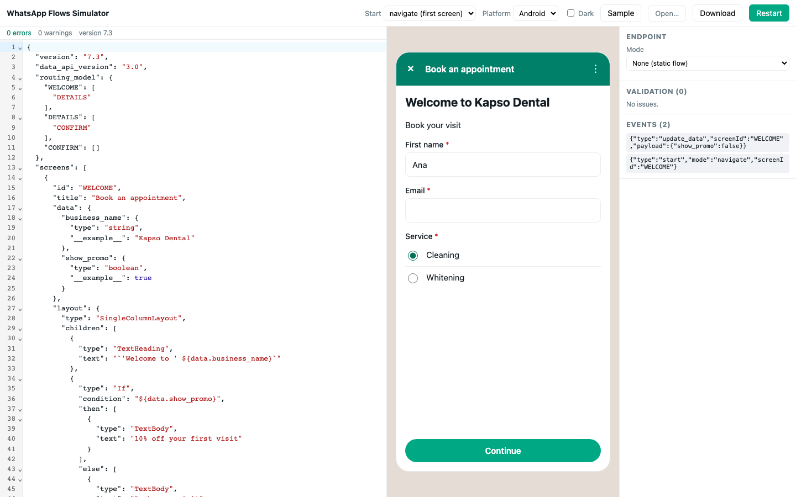

# flowso

**Flowso** is a local WhatsApp Flows development toolkit by [Kapso](https://kapso.ai).

Run WhatsApp Flows locally. Render a Flow JSON, walk through its screens, fill forms, and call
your **real data endpoint** with the same encryption Meta uses. No Meta account or WhatsApp
Manager needed to iterate. Works with or without Kapso.

Coding agents can inspect screens and component snippets, exercise real transitions against a
development endpoint, and replay scenarios with machine-readable failures before deployment.
The browser preview and headless tests use the same runtime.

## Develop with a coding agent

With the CLI installed, create a complete, local booking project:

```sh
flowso init my-booking
cd my-booking
node dev-server.mjs
```

In another terminal in that directory:

```sh
flowso inspect flow.json --endpoint http://127.0.0.1:4312/flow --plaintext --json
flowso test flow.json --scenario scenarios.json --endpoint http://127.0.0.1:4312/flow --plaintext --json
flowso preview flow.json --endpoint http://127.0.0.1:4312/flow --plaintext
```

The starter includes a four-screen dynamic flow, an HTTP data endpoint, a local Cal.com contract
fixture, six repeatable journeys, and an agent skill in `.agents/skills/flowso`. It tests booking,
back/refresh, a slot taken before confirmation, no availability, invalid input, and provider outage
recovery. It creates no real bookings by default. Read the generated README before connecting a
real scheduling API or your own development server.

### Test visually while an agent follows the calls

```sh
flowso preview flow.json --endpoint http://127.0.0.1:4312/flow --plaintext --log-file artifacts/preview.jsonl
```

Open the printed preview URL. This view contains only the phone, a device selector and Restart.
It reloads after file edits, uses real endpoint data, and reports invalid JSON without continuing
to show the old flow. `flowso serve` keeps the full visual builder available when you want it.
This is Flowso's local renderer, not Meta's hosted preview.

The agent can follow the session independently:

```sh
tail -f artifacts/preview.jsonl
```

Without `--log-file`, preview creates a unique log under `artifacts/` and prints its path.
Each JSONL record has `schemaVersion`, `timestamp`, `serverId`, and `sequence`. Endpoint records
have `sessionId` and `requestId` to correlate concurrent browser sessions and requests:

- `exchange.request`: POST destination (without query credentials), transport mode, decoded request/action/screen/data.
- `exchange.response`: decoded response, HTTP status, and duration in milliseconds.
- `exchange.error`: HTTP status when available, normalized error kind/message, and duration.
- `runtime`: starts, screen transitions, local validation failures, completion payloads, and reloads.

Runtime events are received from the browser; endpoint records come from the local proxy. Sequence
is log arrival order. Existing log files are appended to, with a new `serverId` for each server run.
Token, password, secret and API-key fields are redacted; form data remains visible, so use test data
and keep logs out of commits. Headers and encryption keys are not recorded. Failed HTTP responses
are represented by status and normalized errors, not raw response bodies. Calls made internally by
your endpoint (for example to Cal.com) require that endpoint's own logs.

### Install the agent skill

The skill lives in [`skills/flowso`](skills/flowso/SKILL.md) in this repository and uses the
[Agent Skills installer](https://github.com/vercel-labs/skills). Install it separately from the
CLI into an existing project. Once this skill is published to GitHub:

```sh
bunx skills add gokapso/flowso --skill flowso
```

The installer lets you select your agents. Add `--global` to install for use across projects.
During local development, install from your checkout instead:

```sh
bunx skills add /path/to/flowso --skill flowso
```

For offline use with the CLI already installed:

```sh
flowso skill --install .agents/skills/flowso
```

This copies the bundled skill and its references without overwriting an existing directory.
`flowso init` includes the same bundle in new projects. `flowso skill` prints the instructions
and reference content without writing files. Installing a skill does not install the CLI.
The GitHub installer uses the repository version; the offline copy matches the installed CLI
package. Both originate from `skills/flowso`, with no separate copy to maintain in Kapso's repos.

Codex and other skill-aware agents can use the same CLI; no Flowso repository checkout is needed.
`flowso catalog --json` lists component IDs; `flowso catalog text-input --json` returns a canonical
snippet, constraints and a documentation link.

`validate --json`, `inspect --json` and `test --json` each print one JSON result to stdout and
return a nonzero exit status on failure. A scenario file contains named `tests` with `start`
options and ordered `steps`: `fill`, `submit`, `click`, `back`, and `expect`. Run `flowso skill`
for the format or adapt the generated `scenarios.json`. Add `--trace` to capture per-step snapshots
and endpoint requests/responses. Each test has its own runtime and token; external databases and
provider side effects are not reset.

Headless tests disable `__example__` fallback and check declared screen data and endpoint response
versions. They catch missing data that an illustrative preview can hide. `inspect --examples`
explicitly enables examples for design exploration. A local pass verifies the emulator and your
configured endpoint; it does not guarantee Meta acceptance, native widget parity, or a live
provider integration. Review the official preview before publishing.



## What is in the box

One npm package with subpath exports:

| Import | What it gives you |
|---|---|
| `flowso/schema` | TypeScript types for Flow JSON (7.3 first, tolerant of 4.0+), per-component minimum versions. |
| `flowso/runtime` | Pure state machine: screens, back stack, forms, `${data.*}` / `${form.*}` / `${screen.X.*}` bindings, backtick nested expressions, `If` / `Switch`, `navigate` / `complete` / `data_exchange` / `update_data` / `open_url`, client-side validation. No DOM, no network. |
| `flowso/validator` | Local Flow JSON validator that returns diagnostics in the shape of Meta's `validation_errors` (code, message, JSON pointer). |
| `flowso/endpoint` | Client that calls a data endpoint the way Meta does: RSA-OAEP (SHA-256) + AES-128-GCM, flipped IV on responses, `INIT` / `data_exchange` / `BACK` / `ping`, status mapping (421 / 427 / 432). Plaintext and mock modes. Server helper to build a local encrypted endpoint for tests. |
| `flowso/catalog` | Component catalog (every Flow JSON component plus screen patterns, with snippet, minimum version, limits and docs link) and `insertComponent` / `insertScreen` helpers that place a snippet in the right spot of a flow. |
| `flowso/vue` | `FlowPhone` component (WhatsApp-style phone frame with Android and iOS looks, dark mode) and `useFlowRuntime` composable. |
| `flowso` (CLI) | `init`, `catalog`, `inspect` and `test` support local agent development. `serve` opens the visual builder and proxies endpoint calls. `validate`, `deploy` and `send` cover validation and rollout. |

## Quick start

```bash
# Static flow: render and walk through it
npx flowso serve flow.json

# Flow with an endpoint: encrypt requests with your business public key, call your endpoint
npx flowso serve flow.json --endpoint https://example.com/flow --public-key ./public.pem

# Plaintext endpoint (your local dev server without encryption)
npx flowso serve flow.json --endpoint http://localhost:3000/flow --plaintext

# No endpoint yet? Try the bundled example (encrypted), in a second terminal:
bun examples/endpoint-server.ts --encrypted      # writes examples/public.pem
npx flowso serve fixtures/appointment.flow.json --endpoint http://127.0.0.1:4312/flow --public-key examples/public.pem

# CI
npx flowso validate flow.json

# Upload to Meta as a draft (needs a WABA id and a token with whatsapp_business_management)
WHATSAPP_ACCESS_TOKEN=... npx flowso deploy flow.json --waba <WABA_ID> --name my-flow
# ...and publish it once you are happy
WHATSAPP_ACCESS_TOKEN=... npx flowso deploy flow.json --waba <WABA_ID> --flow-id <FLOW_ID> --publish
```

`deploy` runs the local validator first, uploads the JSON unchanged through
[`@kapso/whatsapp-cloud-api`](https://github.com/gokapso/whatsapp-cloud-api-js), prints the flow id,
Meta's own validation errors (with JSON paths) and an interactive preview URL you can share.

Open the printed URL. Left: the visual builder with a JSON toggle and inline diagnostics. Middle: the phone. Right:
endpoint mode, validation issues, and the event log (every navigation, `data_exchange` request and
response with timing, validation failure and completion payload).

The completion screen shows exactly what WhatsApp sends back to your business in
`interactive.nfm_reply.response_json`.

**Components** opens a Block Kit Builder–style gallery: pick any component or screen pattern, see
it rendered by the real runtime, edit its JSON by hand, and insert it into a screen of your flow
(inside the Form when there is one, before the Footer, with duplicate input names renamed).

## Visual builder

The Builder starts with a visual panel: select a screen, expand a component to edit its text or
options, and drag its grip to reorder. Components move within their Form, condition branch, or
layout; the Footer stays at the end. The grips also accept Alt+Up and Alt+Down. Expand a component
for Move up, Move down, and Remove buttons.

**Add content** opens a categorized menu: Text, Media, Text response, Selection, and Advanced.
Hover or select a category to open its submenu; on narrow screens it opens in place with a Back
button. Arrow keys navigate, Right opens a submenu, and Left or Escape returns. Selecting a
component inserts it into the selected screen and updates the preview.

Use **Visual / JSON** to switch the panel to the complete Flow JSON editor. Both modes edit the
same draft and the phone stays in place. Invalid JSON is preserved; fix it in JSON mode before
returning to visual editing. Complex properties such as actions remain editable as JSON.

The panel is also exported for embedding in Vue applications:

```vue
<script setup lang="ts">
import { ref } from 'vue';
import { FlowBuilderPanel } from 'flowso/vue';
import 'flowso/vue/theme.css';

const source = ref(JSON.stringify(flowJson, null, 2));
</script>

<template>
  <FlowBuilderPanel v-model="source" @select-screen="selectPreviewScreen" />
</template>
```

`modelValue` is the JSON source string. `disabled` makes both modes read only. `select-screen`
emits a screen ID for the host's preview. The optional `json` slot receives `value` and `update`
so a host can supply its own code editor. The panel does not save to a backend or call an endpoint.

## Ship it to Meta

You need two things from Meta: the **WABA ID** of your WhatsApp Business Account and an
**access token** that can manage it. No Kapso account is required.

1. Create an app at [developers.facebook.com](https://developers.facebook.com/apps) (type
   *Business*) and add the **WhatsApp** product. The app does not need to be published.
2. In [Business Manager](https://business.facebook.com/settings) go to *Users → System users*,
   create a system user, click *Add assets*, and give it full control of your WhatsApp account and
   your app.
3. Click *Generate new token*, pick the app, choose *never expires* for development, and tick
   `whatsapp_business_management` and `whatsapp_business_messaging`.
4. Copy the WABA ID from *Accounts → WhatsApp accounts*, and the phone number ID from the WhatsApp
   product page of your app (or from the API: `GET /{WABA_ID}/phone_numbers`).

Then, from the folder with your flow:

```bash
export WHATSAPP_ACCESS_TOKEN=EAAG...
export WHATSAPP_WABA_ID=1234567890

npx flowso validate my-flow.json                  # what Meta would reject, before uploading
npx flowso deploy my-flow.json --name my-flow     # draft on Meta + interactive preview URL
npx flowso deploy my-flow.json --flow-id <FLOW_ID> --publish   # iterate, then publish
npx flowso send --to-number +15551234567 --flow-id <FLOW_ID> --phone-number-id <PHONE_ID> --draft
```

`deploy` uploads the JSON unchanged, prints Meta's validation errors with their JSON paths, and
returns a preview URL you can open or share. `send` delivers the flow to a phone as a WhatsApp
message; use `--draft` until the flow is published. Flows with a data endpoint also need
`--endpoint-uri` and the encryption key registered on the phone number.

### Deploying through Kapso instead

If your number is connected to [Kapso](https://kapso.ai), `flowso deploy --to kapso` uses your
project API key and the flow shows up in the Kapso dashboard with its versions and preview:

```bash
export KAPSO_API_KEY=...
npx flowso deploy my-flow.json --to kapso --phone-number-id <PHONE_ID> --name my-flow
```

For a dynamic draft, load `KAPSO_API_KEY`, `WHATSAPP_PHONE_NUMBER_ID` and the provider
configuration into your environment, then deploy the function and its secrets together:

```sh
flowso deploy flow.json --to kapso \
  --data-endpoint kapso-data-endpoint.js \
  --secret-env CAL_API_KEY \
  --secret-env CAL_API_BASE_URL \
  --secret-env CAL_EVENT_TYPE_IDS \
  --secret-env CAL_TIME_ZONE \
  --secret-env CAL_ALLOW_BOOKINGS \
  --setup-encryption --register-endpoint
```

Use the variable names your function actually reads. Keep `CAL_ALLOW_BOOKINGS=0` for
availability-only testing. The endpoint must be standalone Kapso JavaScript with
`async function handler(request, env)`, reading `body.data_exchange` from the request.
A local development server cannot be uploaded as-is.

`--secret-env` accepts **environment variable names only**, never secret values. Missing or
empty values stop deployment before any remote write. Flowso does not load `.env` files.
The function is deployed before its secrets are upserted, then registered with Meta.
Flow JSON is re-uploaded after registration for final compilation. Success requires zero Meta
validation errors, configured encryption, a registered endpoint, draft status, and a preview
URL refreshed by Kapso during that final upload.
Dynamic request error bodies are omitted from CLI output to avoid echoing secrets or source.

To update or retry, add `--flow-id KAPSO_UUID` and include every existing function secret.
Flowso checks existing secret names before writing so a redeploy can restore them all.
The command reports each completed stage and the draft ID. Deployment is not atomic:
completed steps remain if a later step fails. Pause tests of an already registered draft
while replacing its function. If a create request fails without returning an ID, inspect
Kapso before retrying, since the remote draft may already exist.

Encryption setup reuses existing keys. `--setup-encryption` and `--register-endpoint` are
optional when already configured; both require `--data-endpoint`. Existing published flows are rejected, and dynamic
deployment cannot be combined with `--publish`. Test the returned official preview and inspect
Kapso invocations before publishing in a separate, explicitly requested step.
See the bundled [deployment skill reference](skills/flowso/references/kapso-deploy.md).

## Use the runtime in your own code

```ts
import { createFlowRuntime } from 'flowso/runtime';
import { createEndpointClient } from 'flowso/endpoint';
import flow from './flow.json';

const runtime = createFlowRuntime({
  flow,
  endpoint: createEndpointClient({ url: 'https://example.com/flow', mode: 'encrypted', publicKeyPem }),
  flowToken: 'test-token',
});

await runtime.start({ mode: 'navigate' });         // or { mode: 'data_exchange' } to send INIT
await runtime.setFormValue('email', 'ana@example.com');
const footer = runtime.render()?.children.find((node) => node.type === 'Footer');
await runtime.dispatch(footer.props['on-click-action']);
console.log(runtime.getState().screenId, runtime.getState().completion);
```

`runtime.render()` returns the current screen as a flat list of components with every dynamic
property resolved, `If` / `Switch` evaluated, invisible components removed, and input values and
errors attached. Any UI can render that list; the Vue renderer is one implementation.

## Use the Vue component

```vue
<script setup lang="ts">
import { FlowPhone } from 'flowso/vue';
import 'flowso/vue/theme.css';
</script>

<template>
  <FlowPhone :flow="flowJson" :endpoint="endpoint" platform="ios" @event="log" />
</template>
```

## Test your endpoint without the UI

```ts
import { createEndpointClient, createLocalEndpointHandler, generateKeyPair } from 'flowso/endpoint';

const { publicKeyPem, privateKeyPem } = generateKeyPair();
// Mount createLocalEndpointHandler({ privateKeyPem, handler }) on node:http to emulate your endpoint,
// or point createEndpointClient at the real one.
const client = createEndpointClient({ url: 'https://example.com/flow', mode: 'encrypted', publicKeyPem });
const response = await client.exchange({ version: '3.0', action: 'INIT', flow_token: 't', data: {} });
```

## What matches production and what does not

Matches: Flow JSON structure and versions, bindings and nested expressions, navigation and back
stack, form validation rules (required, min/max chars, email, number, pattern, min/max selected),
`update_data`, endpoint protocol and encryption, completion payload.

Approximate: visual styling (close to Android and iOS, not pixel-exact), markdown rendering,
date and calendar pickers (native inputs), photo and document pickers (file names only, no media
upload). `If` / `Switch` and expressions follow Meta's documentation; edge cases of coercion are
not verified against the real client yet.

Not simulated: sending the Flow message, template rendering, WhatsApp Web vs mobile differences.

## Development

```bash
bun install
bun run test            # vitest
bun run typecheck       # tsc
bun run typecheck:vue   # vue-tsc (SFCs)
bun run playground      # Vite dev server on http://127.0.0.1:4310 (proxies /__sim to :4311)
bun run cli serve fixtures/appointment.flow.json --port 4311   # API for the dev playground
bun examples/endpoint-server.ts                                 # sample endpoint on :4312
bun run build           # dist/ (library, types, playground)
bun run test:package    # build, pack, install in a clean consumer, test CLI/resources/journeys
```

Requires Node 20 or newer for the CLI and the endpoint client (uses `node:crypto`). The runtime,
validator and Vue renderer run in any modern browser.

License: MIT.

## Deployed Kapso development

Use `KAPSO_API_KEY`; `--flow-id` is the Kapso UUID. Flowso resolves the Meta ID automatically.

```sh
flowso preview-url --to kapso --flow-id KAPSO_UUID --json
flowso verify --to kapso --flow-id KAPSO_UUID \
  --data '{"name":"Flowso Test","email":"flowso@example.test","date":"2030-06-10"}' --json
# Only when a real WhatsApp test message is requested:
flowso send --to kapso --flow-id KAPSO_UUID --to-number +15551234567
# Only when real booking writes are authorized (draft, expiry-aware endpoint):
flowso bookings enable --to kapso --flow-id KAPSO_UUID --for 10m
flowso bookings disable --to kapso --flow-id KAPSO_UUID
flowso secrets set --to kapso --flow-id KAPSO_UUID --secret-env CAL_API_KEY
flowso endpoint deploy --to kapso --flow-id KAPSO_UUID \
  --data-endpoint kapso-data-endpoint.js --secret-env CAL_API_KEY
```

`verify` requires an endpoint-enforced read-only contract, checks registration and exercises INIT, availability, REVIEW and BACK without confirmation. It invokes the deployed function directly; Meta's encrypted transport and UI still need an interactive check. `send` actually sends a WhatsApp message and uses the Flow's draft/published status automatically. Code-only deployment requires all existing secrets, not just the example key above. The starter supports expiring booking permission and distinct provider errors; existing projects must adopt its new guard explicitly.

See [deployed operations and safety contracts](skills/flowso/references/kapso-operations.md) for setup, limitations, recovery and agent instructions.
